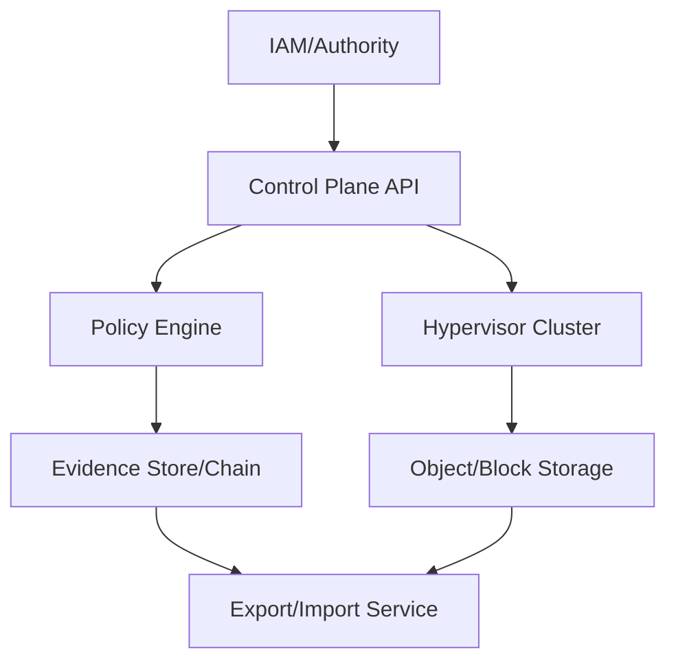

# VM-First / IaaS-Centric Archetype (Non-Normative)

## Intent
Map ECS planes to a VM-centric provider where the primary unit of execution is a virtual machine.

## Plane-to-component mapping (illustrative)
| ECS plane | VM/IaaS-aligned components | Evidence/interop notes |
|---|---|---|
| Plane A — Identity/Authority | IAM/tenant directory, authority binding registry | Authority bindings enforced at API gateway and control plane |
| Plane B — Control Plane/LZ | IaaS control plane, policy engine, network segmentation, image catalog | Admission/refusal evidence recorded for VM provisioning |
| Plane C — Execution Envelopes | Hypervisor clusters, VM images, vTPM/TEE options | Attestation evidence for VM boot/runtime |
| Plane D — Data & Evidence | Object storage, block storage, audit log pipeline | EOSC metadata enforced on object storage |
| Plane E — Interop & Portability | API gateway, export/import services, migration tooling | VM export bundles with evidence and integrity manifests |

## Control and evidence flow (Mermaid)

## Notes
- Suitable for providers with strong VM/IaaS heritage.
- Container profile can be layered via managed container services if desired.
