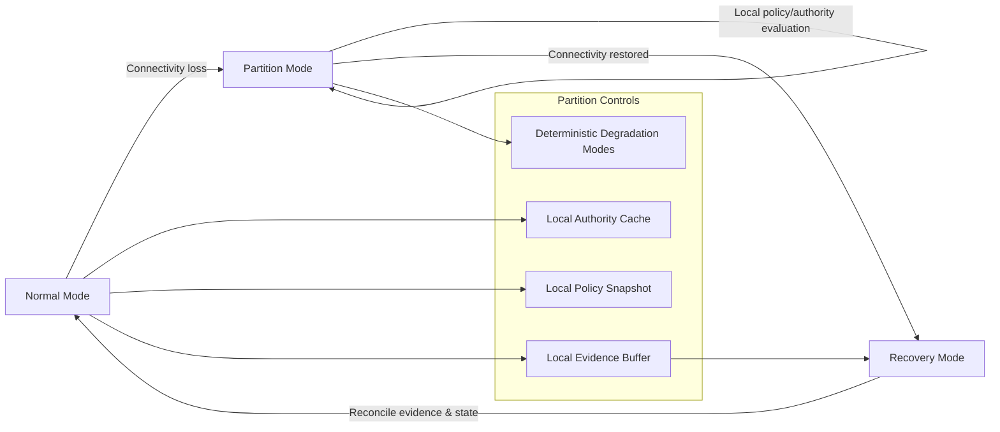

# Crisis Resilience Profile (CRP) — Diagram

Key notes:
- Partition Mode relies on local authority/policy snapshots; fail closed if unsatisfied.
- Evidence is buffered locally and reconciled in Recovery Mode.
- Degradation modes are deterministic and auditable.
