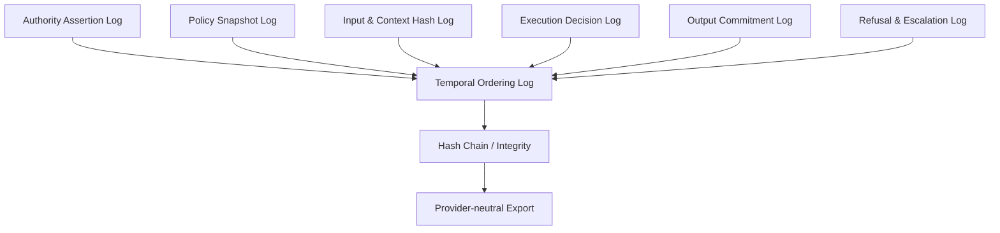

# Immutable AI Workload Log Primitives (IALP) — Diagram

```mermaid
flowchart TD
    Auth[Authority Assertion Log]
    Policy[Policy Snapshot Log]
    Input[Input & Context Hash Log]
    Decision[Execution Decision Log]
    Output[Output Commitment Log]
    Refusal[Refusal & Escalation Log]
    Order[Temporal Ordering Log]

    Auth --> Order
    Policy --> Order
    Input --> Order
    Decision --> Order
    Output --> Order
    Refusal --> Order

    Order --> Chain[Hash Chain / Integrity]
    Chain --> Export[Provider-neutral Export]
```

Notes:
- All primitives feed a monotonic, tamper-evident ordering log.
- Exports MUST preserve ordering and integrity proofs.
