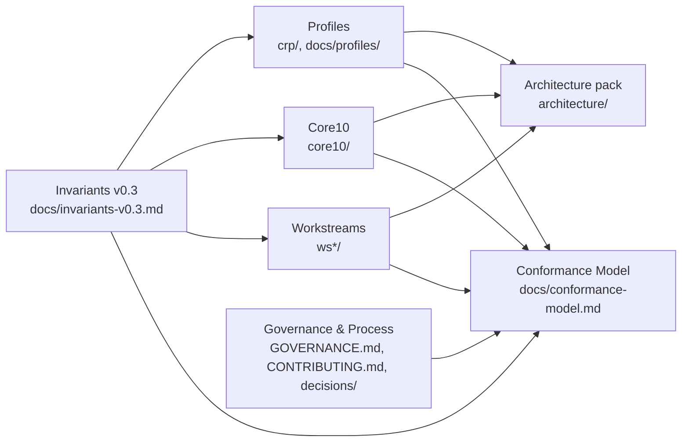
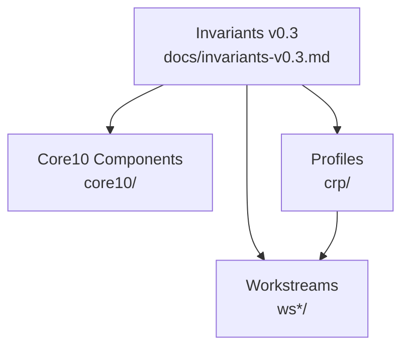

# Reference Architecture (Skeleton)

## Planes
- **Plane A — Identity, Tenancy, Authority:** tenant model, identity binding, explicit authority points, accountable ownership.
- **Plane B — Control Plane & Landing Zone:** network/policy baseline, observability baseline, audit baseline, admission gates.
- **Plane C — Execution Envelopes:** container orchestration baseline (Kubernetes), VM/TEE envelope profiles for stronger isolation.
- **Plane D — Data & Evidence Substrate:** EOSC object storage, governance metadata, evidence chain persistence.
- **Plane E — Interop & Portability:** versioned interop APIs, export/import flows, migration validation gates.

## Diagram convention
- Mermaid is the baseline for diagrams in this repo.

## Conceptual diagram (Mermaid)
```mermaid
flowchart TB
    subgraph A[Plane A: Authority & Identity]
      A1[Org/Tenant/Project Identity]
      A2[Authority Binding (Human/Institutional)]
      A3[Decision Rights]
    end

    subgraph B[Plane B: Control Plane / Landing Zone]
      B1[Network & Egress Baseline]
      B2[Policy Enforcement & Refusal]
      B3[Audit & Evidence Emission]
      B4[Deterministic Routing]
    end

    subgraph C[Plane C: Execution Envelopes]
      C1[Kubernetes Envelope]
      C2[VM-class Envelope]
      C3[Lifecycle Boundaries]
    end

    subgraph D[Plane D: Data & Evidence Substrate]
      D1[EOSC Object Storage]
      D2[Governance Metadata]
      D3[Immutable Evidence Chains]
    end

    subgraph E[Plane E: Interop & Portability]
      E1[Interop API Surface]
      E2[Export/Import Jobs]
      E3[Migration Validation]
    end

    A -->|Authority check| B
    A -->|Ownership attribution| B
    B -->|Route / refuse| C
    B -->|Evidence events| D
    C -->|Read/write data| D
    C -->|Integrity hashes| D
    B -->|Interop API| E
    D -->|Evidence export| E
```

## Deliverables map (Mermaid)


## Invariants-to-components overview (Mermaid)


## Archetypes (non-normative)
These archetypes map the ECS planes to common provider architectures so vendors can align existing stacks to ECS without prescribing a single universal design.

- OpenShift/Kubernetes-based: `architecture/archetypes/openshift.md`
- VM-first / IaaS-centric: `architecture/archetypes/iaas-vm.md`
- Managed platform competitor: `architecture/archetypes/managed-platform.md`

## To-do
- Add Mermaid/PlantUML diagrams for plane boundaries and flows.
- Map Core 10 to planes.
- Define evidence and control flows (fail-closed, escalation hooks).
