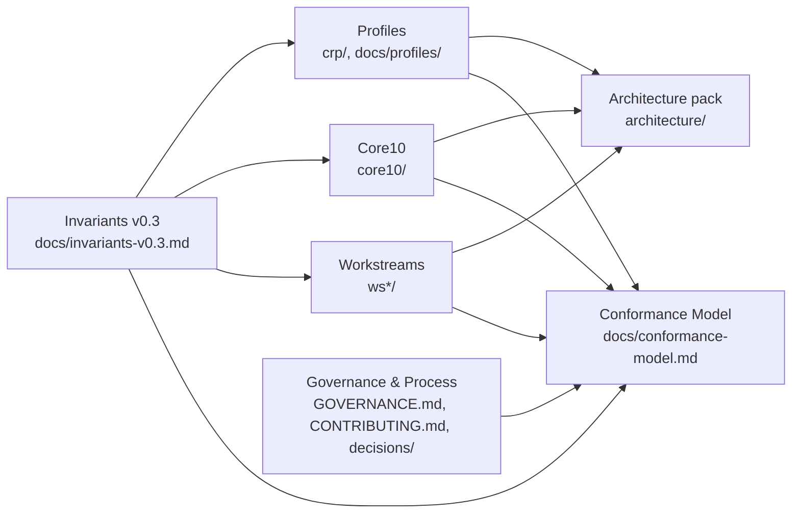
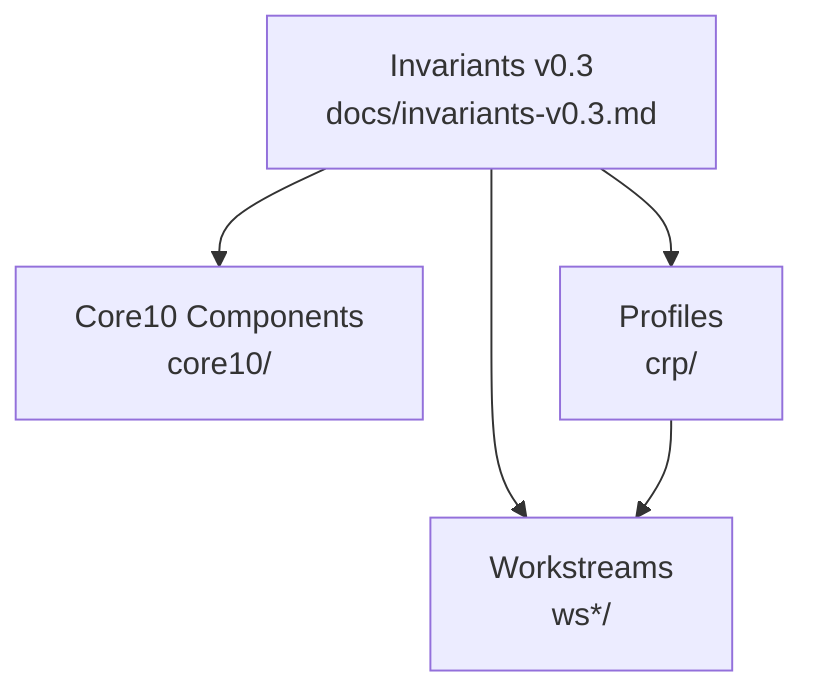

# Reference Architecture (Skeleton)

## Planes
- **Plane A — Identity, Tenancy, Authority:** tenant model, identity binding, explicit authority points, accountable ownership.
- **Plane B — Control Plane & Landing Zone:** network/policy baseline, observability baseline, audit baseline.
- **Plane C — Execution Envelopes:** container orchestration baseline (Kubernetes), VM envelope profile (e.g., KubeVirt) for stronger isolation.
- **Plane D — Data Substrate:** S3-like interface, governance metadata, evidence-grade storage semantics.

## Diagram convention
- Mermaid is the baseline for diagrams in this repo.

## Conceptual diagram (Mermaid)
```mermaid
flowchart TB
    subgraph A[Plane A: Authority & Identity]
      A1[Org/Tenant/Project Identity]
      A2[Authority Binding (Human/Institutional)]
      A3[Decision Rights]
    end

    subgraph B[Plane B: Control Plane / Landing Zone]
      B1[Network & Egress Baseline]
      B2[Policy Enforcement & Refusal]
      B3[Audit & Evidence Emission]
      B4[Deterministic Routing]
    end

    subgraph C[Plane C: Execution Envelopes]
      C1[Kubernetes Envelope]
      C2[VM-class Envelope]
      C3[Lifecycle Boundaries]
    end

    subgraph D[Plane D: Data & Evidence Substrate]
      D1[S3-like Object Storage]
      D2[Governance Metadata]
      D3[Immutable Evidence Chains]
    end

    A -->|Authority check| B
    A -->|Ownership attribution| B
    B -->|Route / refuse| C
    B -->|Evidence events| D
    C -->|Read/write data| D
    C -->|Integrity hashes| D
```

## Deliverables map (Mermaid)


## Invariants-to-components overview (Mermaid)


## To-do
- Add Mermaid/PlantUML diagrams for plane boundaries and flows.
- Map Core 10 to planes.
- Define evidence and control flows (fail-closed, escalation hooks).
