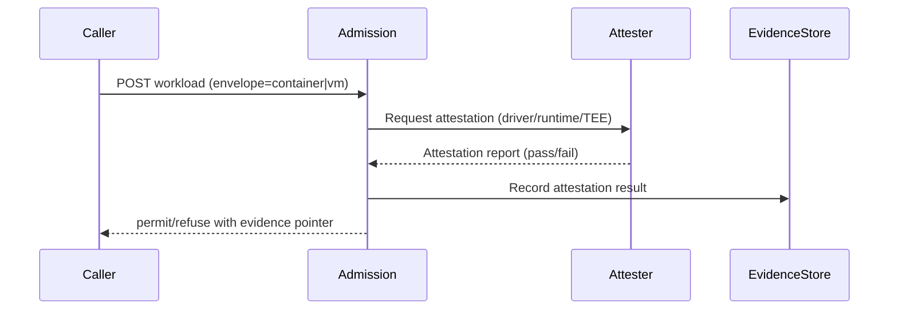

# Execution Envelope Profiles — Placeholder

## Intent
Container and VM profiles, including when stronger isolation is required.

## Invariant families (refs)
- EXEC (envelope declaration, controls)
- AUTH/POL (admission gates)
- EVID (lifecycle events, attestation)
- DEP (envelope dependencies)
- CRP tie: EXEC-03/04 for partition/degradation where applicable

## Applicable invariant IDs
- EXEC-01/02/03/04/05, AUTH-01/02/04, POL-01/02/03/04/05, EVID-01/03/04/05, DEP-01/02/04, PHY-01/02/03 (as applicable), DATA-01/02, SUP-01/04

## Evidence expectations
- Admission/envelope selection evidence; enforcement logs.
- Attestation results; lifecycle evidence events.
- Dependency declarations for envelope-critical paths.
- Degradation/partition behavior evidence where CRP applies.

## Requirements (draft)
- Workloads MUST declare an execution envelope (container, VM, or other profile) (EXEC-01).
- Admission MUST validate envelope declaration against policy; refusals are first-class and evidenced (AUTH-01/04, POL-01/04).
- Envelope lifecycle events (create/start/stop/destroy) MUST emit evidence (EVID-01/03).
- Attestation MUST be captured where available (EXEC-02); critical dependencies declared (DEP-01/02).
- Envelopes MUST honor jurisdiction/residency constraints (DATA-01/02, PHY-01).

### Container profile (draft)
- Runtime isolation (e.g., gVisor, Kata, or standard runc hardened with seccomp/AppArmor).
- Image provenance and integrity verification (SUP-01/04).
- Network/policy enforcement aligned with tenant isolation.

### VM profile (draft)
- Hypervisor isolation; vTPM/TEE attestation where available.
- Boot integrity verification; driver/firmware provenance (SUP-01/04).
- Enforced network/policy posture consistent with tenant isolation.

## Attestation flow (illustrative)


## Attestation evidence snippet (JSON)
```json
{
  "event_type": "workload.attestation",
  "timestamp": "2025-01-01T00:00:00Z",
  "workload_id": "wl-123",
  "envelope_type": "vm",
  "attestation_type": "tee",
  "report_ref": "eosc://evidence/att-123",
  "outcome": "success"
}
```

## Conformance outline (draft)
- Verify envelope declaration is required for workload admission.
- Test admission refusal on policy violation with evidence.
- Validate lifecycle evidence events.
- Confirm attestation capture and dependency declarations for envelopes.
- Check residency/jurisdiction constraints are enforced per envelope.

## To cover
- Kubernetes baseline (controls, admission, policy posture).
- VM envelope profile (e.g., KubeVirt) for regulated/high-liability workloads.
- Attestation, isolation, and evidence capture expectations.

## Invariants (draft)
- Workloads MUST declare container vs. VM envelope; selection criteria MUST be policy-driven.
- Admission controls MUST enforce profile selection and required controls before execution.
- Envelope operations MUST emit evidence for lifecycle events and attestation results.

## Next steps
- Define profile triggers and mandatory controls.
- Describe conformance checks for each profile.
