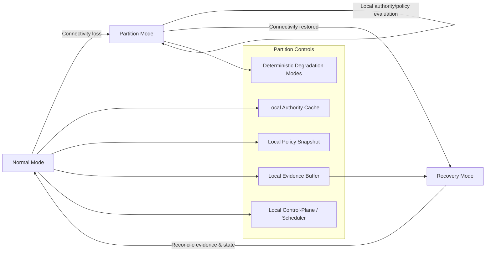

# CRP Diagram (Mermaid)

```mermaid
flowchart LR
    A[Normal Mode] -->|Connectivity loss| B[Partition Mode]
    B -->|Local authority/policy evaluation| B
    B -->|Connectivity restored| C[Recovery Mode]
    C -->|Reconcile evidence & state| A

    subgraph Partition Controls
      B1[Local Authority Cache]
      B2[Local Policy Snapshot]
      B3[Local Evidence Buffer]
      B4[Deterministic Degradation Modes]
      B5[Local Control-Plane / Scheduler]
    end

    A --> B1
    A --> B2
    A --> B3
    A --> B5
    B --> B4
    B3 --> C
```
