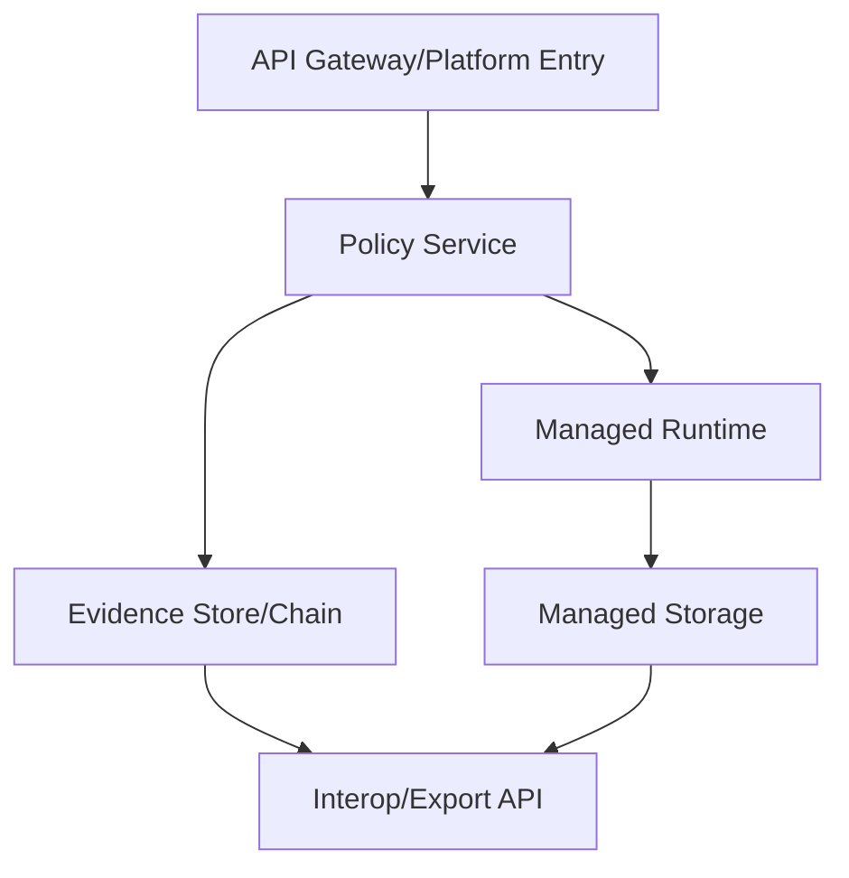

# Managed Platform Archetype (Non-Normative)

## Intent
Map ECS planes to providers offering a managed platform (PaaS/serverless/managed runtime) rather than direct infrastructure control.

## Plane-to-component mapping (illustrative)
| ECS plane | Managed-platform components | Evidence/interop notes |
|---|---|---|
| Plane A — Identity/Authority | Platform identity, tenant accounts, authority binding registry | Authority binding enforced at platform entry points |
| Plane B — Control Plane/LZ | Platform control plane, policy service, routing, tenancy isolation | Admission/refusal evidence for app/runtime changes |
| Plane C — Execution Envelopes | Managed runtimes, function/workload sandboxes | Envelope declarations map to runtime classes/tiers |
| Plane D — Data & Evidence | Managed storage, logging/audit pipeline, evidence chain | Evidence export/retention integrated with platform logging |
| Plane E — Interop & Portability | Platform APIs, export/import tooling, migration workflows | Interop APIs expose portability for workloads and evidence |

## Control and evidence flow (Mermaid)

## Notes
- Suitable for providers emphasizing managed services and higher abstraction.
- Requires careful mapping of envelope declarations to runtime classes.
