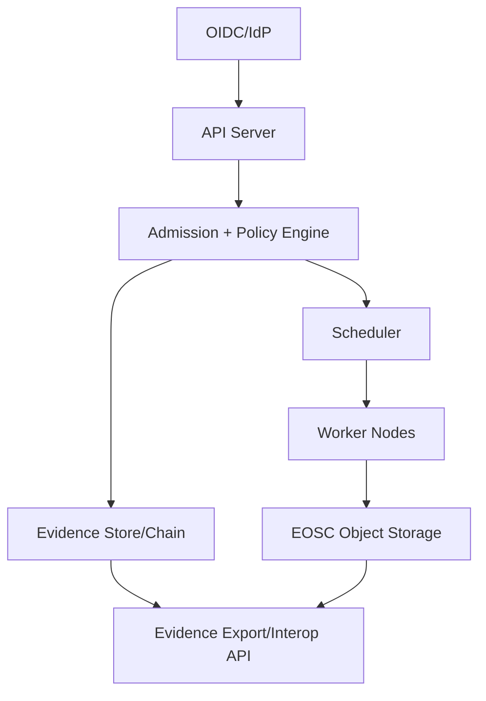

# OpenShift/Kubernetes-Based Archetype (Non-Normative)

## Intent
Map ECS planes to an OpenShift/Kubernetes-style architecture for EU OpenShift positioning.

## Plane-to-component mapping (illustrative)
| ECS plane | OpenShift/K8s-aligned components | Evidence/interop notes |
|---|---|---|
| Plane A — Identity/Authority | IdP + OIDC, cluster RBAC, tenant/project model | Authority binding and policy snapshot ids recorded in admission events |
| Plane B — Control Plane/LZ | API server, admission controllers, policy engine (OPA/Kyverno), network policy | Admission decisions emit evidence; fail-closed policies enforced at admission |
| Plane C — Execution Envelopes | Kubernetes runtime (container profile), KubeVirt/VM operator (VM profile), TEE nodes (optional) | Attestation and runtime integrity evidence linked to workload admission |
| Plane D — Data & Evidence | EOSC-compatible object storage, evidence store/log pipeline, hash chain | Evidence export/read APIs, retention enforcement |
| Plane E — Interop & Portability | Interop API gateway, export/import jobs, migration controller | Versioned APIs + export package validation |

## Control and evidence flow (Mermaid)

## Notes
- Suitable when Kubernetes/OpenShift is the primary control plane.
- VM profile can be implemented with KubeVirt or equivalent.
- Policy engines should support deterministic evaluation and refusal evidence.
- CRDs/operators are valid differentiation layers; if they affect governed behavior or portability, they SHOULD emit evidence and be declared in dependency/exit manifests.
- Service mesh (e.g., Istio/Linkerd) is optional; if it enforces authz/egress or produces governance decisions, it SHOULD emit evidence and be declared in portability manifests.
- MetalLB/L4 LB and WAF/Ingress are optional; if they enforce policy or jurisdictional routing (e.g., block non‑sovereign failover), they SHOULD emit evidence and be declared in dependency/exit manifests.

### Examples (jurisdictional routing evidence)
- **Failover blocked**: LB attempts to route to a non‑sovereign region → refusal evidence with jurisdiction rule + target region.
- **WAF geo‑policy**: request denied due to geo/jurisdiction policy → refusal evidence with policy snapshot id.
- **Ingress routing**: tenant traffic routed only to approved zone/cluster → routing decision evidence with policy snapshot id.
