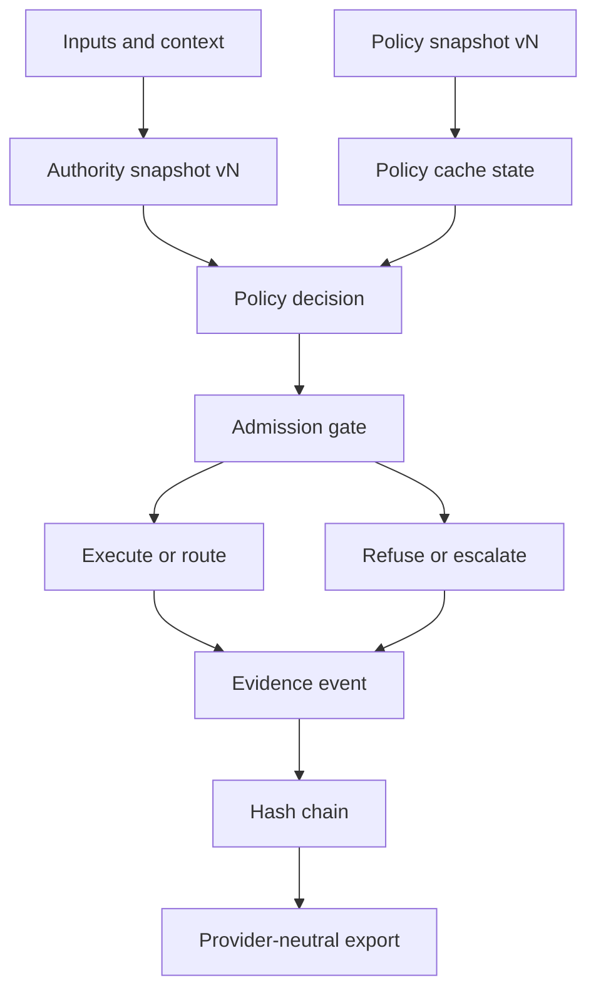
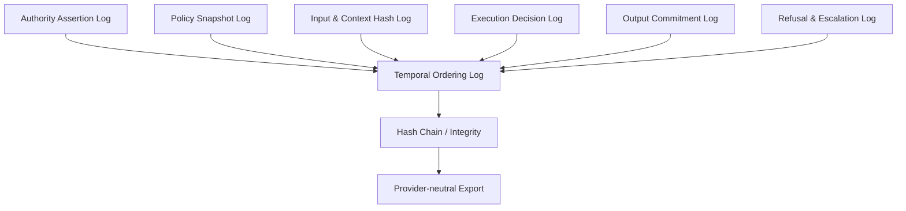

# Immutable AI Workload Log Primitives (IALP) — Diagram

## Authorization flow (IALP)

Notes:
- Authority and policy snapshots are versioned and referenced in each decision event.
- Cache state influences whether decisions proceed or fail closed.
- Refusals are first-class outcomes with evidence, not silent failures.

### Walkthrough (aligned with VISION.md)
1. **Inputs & context** arrive at the admission gate with a correlation id.
2. **Authority snapshot vN** is resolved (who can act) and bound to the decision.
3. **Policy snapshot vN** is resolved (what is allowed), with **cache state** checked for freshness.
4. The **policy decision** yields accept/refuse; refusal is a valid outcome with explicit evidence.
5. **Evidence events** are emitted and chained for integrity, then exported via provider‑neutral bundles.

## Primitives

Notes:
- All primitives feed a monotonic, tamper-evident ordering log.
- Exports MUST preserve ordering and integrity proofs.
