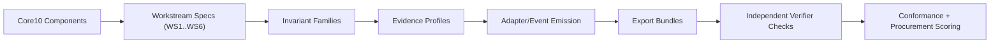

# ECS Implementation Pipeline (Draft)

## Purpose
Provide one start-to-finish view of how ECS moves from architecture definition to verifiable evidence in production.

## Core pipeline

## Who starts where
### Provider implementation order (first)
1. Implement Core10 envelope, policy/authority binding, and fail-closed behavior.
2. Implement one evidence profile end-to-end (baseline first).
3. Emit events through one reference insertion point (admission/sidecar/proxy).
4. Export bundle with verifier inputs and profile claim.

### Deployer verification order (first)
1. Select target `evidence_profile_id` and deployment scope.
2. Run governed action + refusal scenario.
3. Export bundle and run verifier checks.
4. Record gaps and compensating controls.

### Auditor scoring order (first)
1. Validate selected profile and bundle self-description.
2. Validate chain continuity, pointer integrity, and artifact immutability.
3. Validate refusal semantics for policy/jurisdiction/delegation denials.
4. Map outputs into procurement/certification scoring matrix.

## Minimum "done" signal per stage
- Core10: required control points are implemented.
- Workstreams/invariants: scope-specific requirements are mapped and tested.
- Profiles: required fields/events are present and declared.
- Bundles: verifier can validate without provider-private access.
