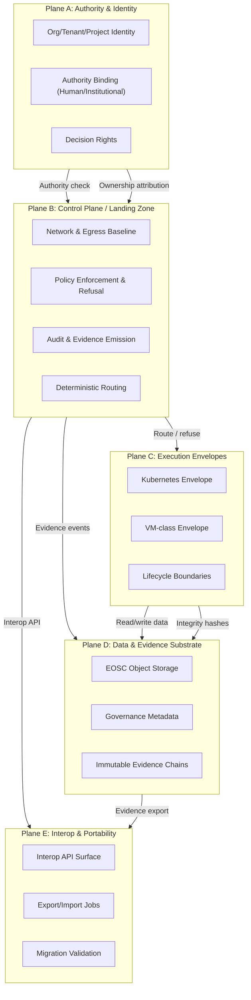
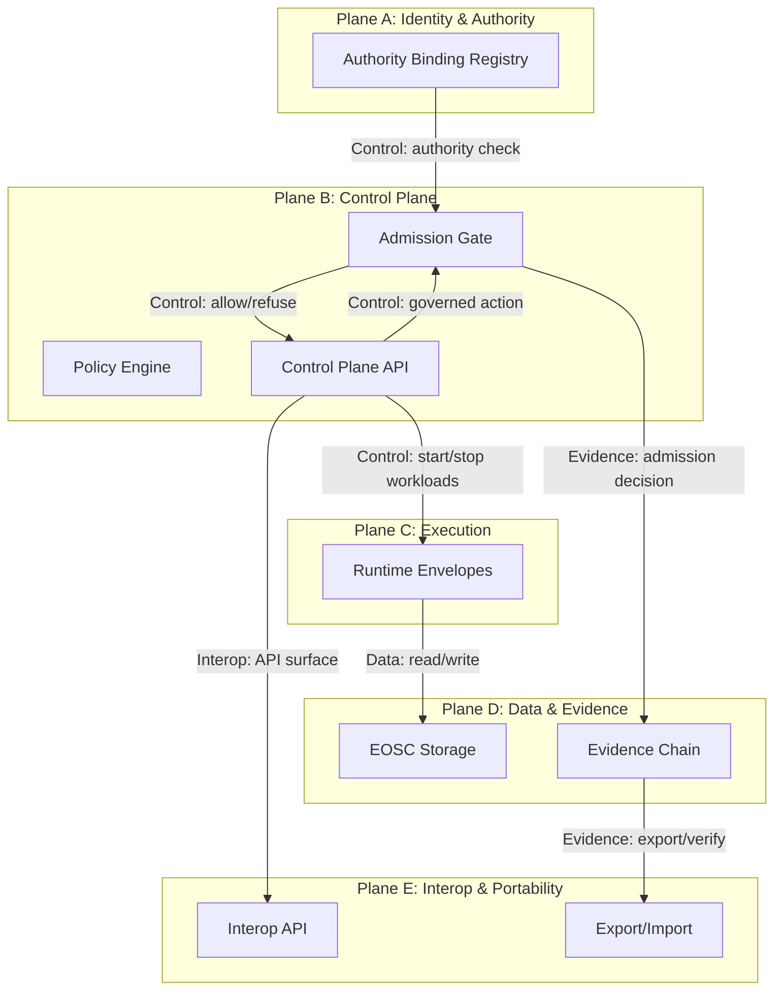
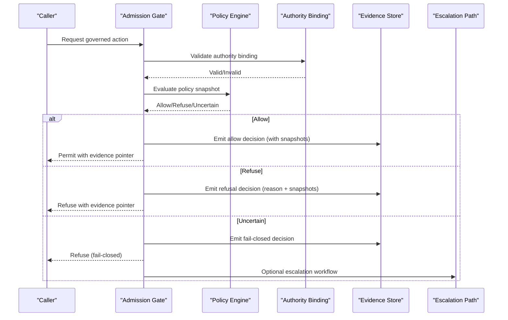
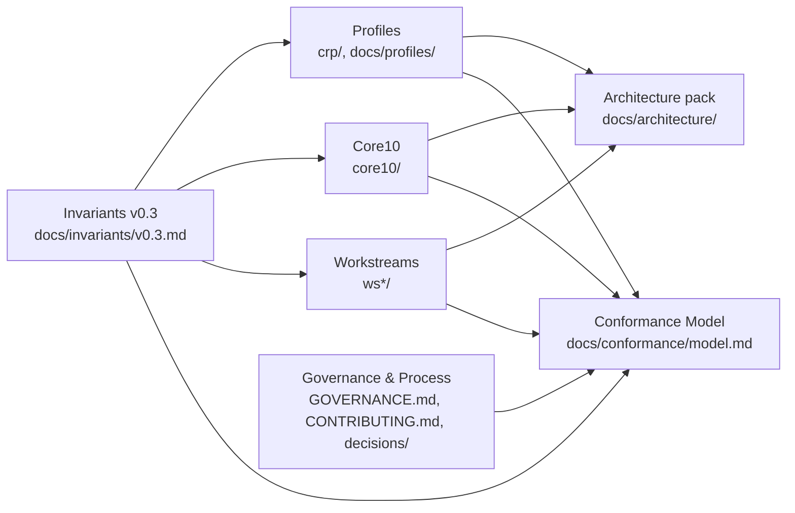
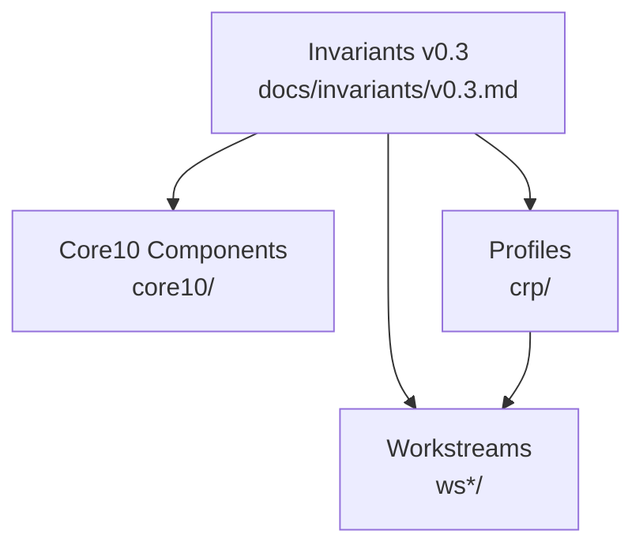

# Reference Architecture (Skeleton)

## Planes
- **Plane A — Identity, Tenancy, Authority:** tenant model, identity binding, explicit authority points, accountable ownership.
- **Plane B — Control Plane & Landing Zone:** network/policy baseline, observability baseline, audit baseline, admission gates.
- **Plane C — Execution Envelopes:** container orchestration baseline (Kubernetes), VM/TEE envelope profiles for stronger isolation.
- **Plane D — Data & Evidence Substrate:** EOSC object storage, governance metadata, evidence chain persistence.
- **Plane E — Interop & Portability:** versioned interop APIs, export/import flows, migration validation gates.

See `docs/architecture/control-plane.md` for control-plane capability definitions (policy engine, admission gate, evidence hooks).

## Diagram convention
- Mermaid is the baseline for diagrams in this repo.

## Conceptual diagram (Mermaid)

## Plane boundaries and flows (Mermaid)

## Core10-to-plane mapping (draft)
| Core10 component | Primary plane(s) | Cross-plane dependencies |
|---|---|---|
| 01 Open Landing Zone | A, B | D (evidence) |
| 02 Tenant Isolation | C | B (admission), D (evidence) |
| 03 EOSC Object Storage | D | E (export), B (policy) |
| 04 Policy & Authority | A, B | D (evidence) |
| 05 Evidence Event Model | D | B/C (emitters), E (export) |
| 06 Audit Chain Baseline | D | B/C (evidence sources) |
| 07 Execution Envelopes | C | B (admission), D (evidence) |
| 08 Interop API Surface | E | A/B (authz), D (evidence) |
| 09 Fail-Closed Profile | B | A (authority), D (evidence) |
| 10 Migration Baseline | E | D (evidence), B (policy), A (authority) |

## Stack view for archetypes (non-normative)
The IPCEI‑CIS reference architecture uses a layered stack (Application → Data → AI → Service Orchestration → Cloud‑Edge Platform → Virtualization → Network → Physical). ECS can map archetypes to that stack without prescribing a platform.

| Archetype | ICRA layer emphasis | ECS focus (contract layer) |
|---|---|---|
| OpenShift‑like | Service Orchestration + Cloud‑Edge Platform + Virtualization | OLZ‑EU baseline, admission evidence, execution envelopes, export bundles |
| VM‑first | Virtualization + Network + Physical | VM envelope profile, data governance metadata, evidence export/migration |
| Managed‑platform | Application + Service Orchestration + Data/AI | Interop API surface, evidence profiles, regulated‑ML evidence exports |

This provides a neutral “stack view” so vendors can self‑place while implementing the same ECS contract layer.

## Architecture upgrade roadmap (draft)
1. **Baseline clarity:** finalize plane boundaries, control/evidence interfaces, and glossary alignment.
2. **Control plane hardening:** specify policy engine and admission gate requirements with conformance tests.
3. **Evidence chain maturity:** define canonical event types, chain verification format, and export schema.
4. **Interop/API hardening:** publish minimal OpenAPI/AsyncAPI surfaces with error and auth semantics.
5. **Portability at scale:** define migration workflows, validation gates, and reference export package format.
6. **Archetype validation:** map OpenShift/VM/Managed/SlapOS stacks to the planes and highlight gaps.

## Evidence and control flows (fail-closed + escalation)

## Deliverables map (Mermaid)

## Invariants-to-components overview (Mermaid)

## Archetypes (non-normative)
These archetypes map the ECS planes to common provider architectures so vendors can align existing stacks to ECS without prescribing a single universal design.

- OpenShift/Kubernetes-based: `docs/architecture/archetypes/openshift.md`
- VM-first / IaaS-centric: `docs/architecture/archetypes/iaas-vm.md`
- Managed platform competitor: `docs/architecture/archetypes/managed-platform.md`
- SlapOS (master/compute, partitions): `docs/architecture/archetypes/slapos.md`

## Compliance pattern library (draft)
- `docs/compliance/pattern-library.md` (non-normative)
