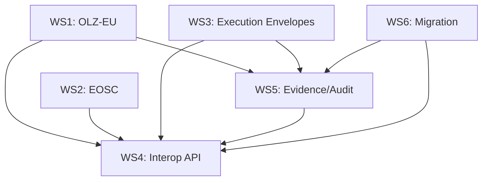

# Workstream Dependencies (Draft, Mermaid)

```mermaid
flowchart TB
    WS1[WS1: OLZ-EU] --> WS4[WS4: Interop API]
    WS1 --> WS5[WS5: Evidence/Audit]
    WS2[WS2: EOSC] --> WS4
    WS3[WS3: Execution Envelopes] --> WS4
    WS3 --> WS5
    WS5 --> WS4
    WS6[WS6: Migration] --> WS4
    WS6 --> WS5
```

Note: Draft view of logical dependencies for coordination; not a blocker graph.
