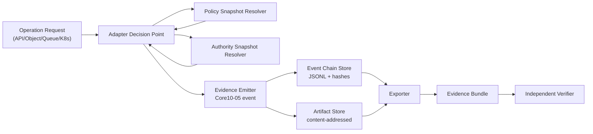

# Runtime Reference Architecture (Draft)

## Purpose
Show a concrete runtime shape vendors can implement without changing ECS semantics.

## Minimal runtime components
1. **Control-point adapter**
   - K8s admission, object proxy, API gateway hook, queue/stream gateway, or sidecar.
2. **Policy/authority snapshot source**
   - Immutable snapshot IDs resolved at decision time.
3. **Evidence emitter**
   - Emits Core10-05 envelope events (accepted/refused/failed).
4. **Artifact store**
   - Content-addressed evidence artifacts.
5. **Exporter**
   - Produces `manifest.json`, `events.jsonl`, `chain-segment.json`, `verifier-inputs.json`, `profile-claim.json`.
6. **Verifier**
   - Runs profile-aware integrity and semantic checks.

## Runtime data flow

## Runtime contract (must-have)
- Decision outcomes: `accepted`, `refused`, `failed`.
- Decision context: `policy_snapshot_id`, `authority_snapshot_id`, `correlation_id`.
- Chain fields: `sequence`, `chain_id`, `event_hash`, `prev_hash`.
- Profile declaration in export: `evidence_profile_id` (and `hash_profile_id` where required).

## Recommended deployment modes
- **Mode A: sidecar/gateway** (fastest adoption)
  - Add ECS emission around existing runtime operations.
- **Mode B: control-plane native**
  - Integrate directly in policy/admission paths.
- **Mode C: event tap + enforcement**
  - Start with emission, move to fail-closed enforcement by profile.

## Failure behavior guidance
- Baseline profile: fail-open can be tolerated for non-critical paths, but refusal evidence is still required when policy denies.
- Regulated/NCP scenarios: use fail-closed where policy/snapshot resolution is mandatory.

## Implementation references
- `adapters/k8s-admission/`
- `adapters/object-storage-proxy/`
- `adapters/ml-inference-sidecar/`
- `docs/examples/runtime/`
