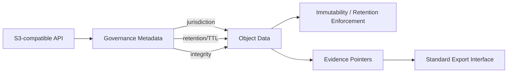

# WS2 Diagram (Mermaid)

```mermaid
flowchart LR
    API[S3-compatible API] --> Metadata[Governance Metadata]
    Metadata -->|jurisdiction| Object[Object Data]
    Metadata -->|retention/TTL| Object
    Metadata -->|integrity| Object
    Object --> Immutability[Immutability / Retention Enforcement]
    Object --> Evidence[Evidence Pointers]
    Evidence --> Export[Standard Export Interface]
```
