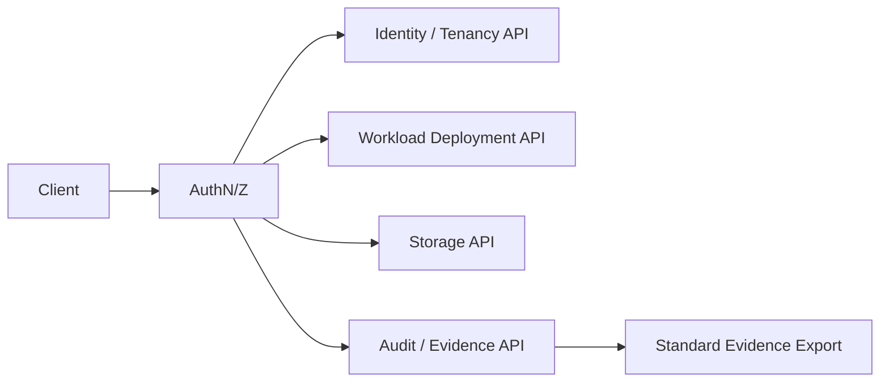

# WS4 Diagram (Mermaid)

```mermaid
flowchart LR
    Client --> Auth[AuthN/Z]
    Auth --> IdentityAPI[Identity / Tenancy API]
    Auth --> WorkloadAPI[Workload Deployment API]
    Auth --> StorageAPI[Storage API]
    Auth --> AuditAPI[Audit / Evidence API]
    AuditAPI --> Export[Standard Evidence Export]
```
