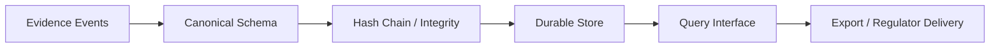

# WS5 Diagram (Mermaid)

```mermaid
flowchart LR
    Events[Evidence Events] --> Schema[Canonical Schema]
    Schema --> Chain[Hash Chain / Integrity]
    Chain --> Store[Durable Store]
    Store --> Query[Query Interface]
    Query --> Export[Export / Regulator Delivery]
```
