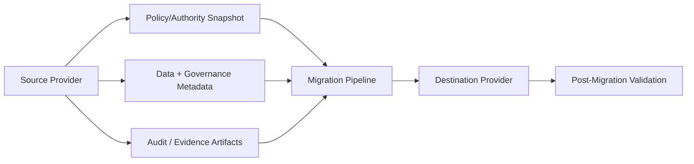

# WS6 Diagram (Mermaid)

```mermaid
flowchart LR
    Src[Source Provider] --> Snapshot[Policy/Authority Snapshot]
    Src --> Data[Data + Governance Metadata]
    Src --> Evidence[Audit / Evidence Artifacts]
    Snapshot --> Transfer[Migration Pipeline]
    Data --> Transfer
    Evidence --> Transfer
    Transfer --> Dest[Destination Provider]
    Dest --> Validate[Post-Migration Validation]
```
